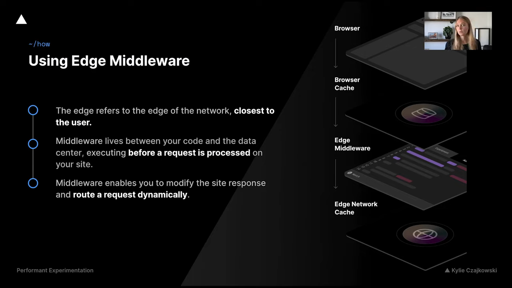

# A/B Testing

- Also known as split run or bucket-testing, A/B testing is the strategy of comparing two or more versions of interface against each other to determine which performs better
- Benifits:
    - Research: Improve user understanding
    - Data: Results backed by data
    - Metrics: Achieve increased conversions
    - Productivity: ++

- Designing a balanced experiment
    - What do you want to see changes ? Exprected Results
    - Hypothesis ? What metric will be affected
    - How can we best assess that hypothesis

- Experiment stats
    - Focus on metric
    - Keep changes small
    - Prepare to iterate

# How ?
- Traditional methods: 
    - Server-side rendering (not good bcz latency + SEO down )
    - Client-side : good but can result in content flickering, layout shift + decreased web vitals ( set of metrics for real-time )

- Edge Middleware
    - 