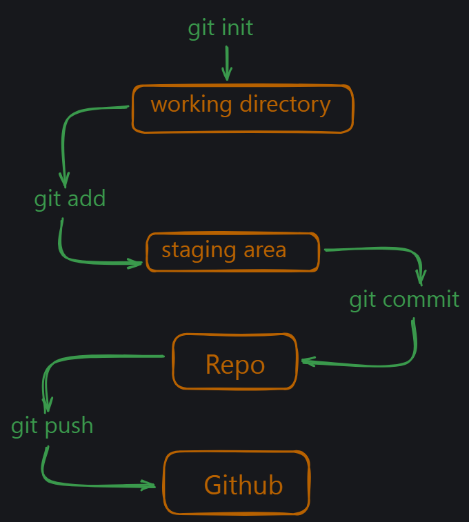
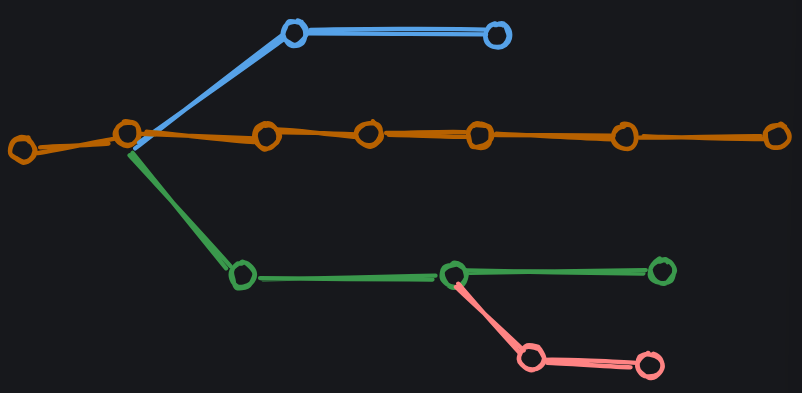
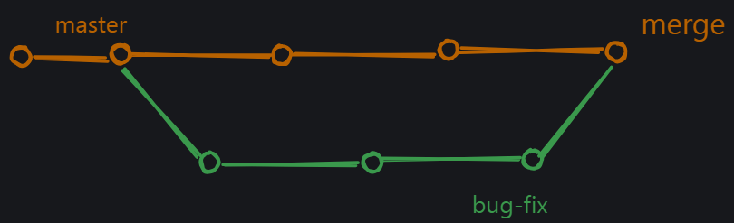

git - software
github - service

version control system - track files for changes

# Start
- Check your git version: `git --version`
- Respository : A repository is a collection of files and directories that are stored together. It is a way to store and manage your code.
- See status: `git status`: green -> tracked, red -> untracked
- `Read about config`
- Create a Repo
    - git status
    - git init
    - Complete Flow -> git init -> git add -> git commit -> git push
    
    - for message -> git commit -m "custom meesage"
- Logs: history of repo: `git log`
- latest : `git log --online`

# Depth
- Atomic commits: way to make sure that each commit is a self-contained unit of work. This means that if one commit fails, you can always go back to a previous commit and fix the issue. This is important for maintaining a clean and organized history in your repository.
- to keep a folder; just add a .gitkeep file in it

# Behind the scenes
- version control system
- A git snapshot is a point in time in the history of your code. It represents a specific version of your code, including all the files and folders that were present at that time. Each snapshot is identified by a unique hash code, which is a string of characters that represents the contents of the snapshot. 

# 3 Major Pillars :
- Commit Object : Each commit in the project is stored in .git folder in the form of a commit object.
- Tree Object : Tree Object is a container for all the files and folders in the project.
- Blob Object : Blob Object is present in the tree object and contains the actual file content. This is the place where the file content is stored.

# Branches and Conflicts
- Branches are a way to work on different versions of a project at the same time. They allow you to create a separate line of development that can be worked on independently of the main branch. This can be useful when you want to make changes to a project without affecting the main branch or when you want to work on a new feature or bug fix.
- 

- HEAD : The HEAD is a pointer to the current branch that you are working on. It points to the latest commit in the current branch. When you create a new branch, it is automatically set as the HEAD of that branch.

the default branch used to be master, but it is now called main. There is nothing special about main, it is just a convention.

- git branch: all branches
- git branch <name>: creates a new branch
- git switch <name>: switches to that branch
- git checkout -c <name>: creates a new branch with the name
- git checkout <name>: switche to the name branch

# Merging Branches
- git checkout <name1>
- git merge <name2>
- So branch name2 will be merged into name1

- git branch -m <old_name> <new_name> : rename a branch
- git branch -d <name> : delete the branch
- git checkout <name>

# Git diff
- The git diff is an informative command that shows the differences between two commits. It is used to compare the changes made in one commit with the changes made in another commit. Git consider the changed versions of same file as two different files. Then it gives names to these two files and shows the differences between them.
- git diff
- It has some further branches
    - git diff --stages : shows changes in last commit and staging area
    - git diff <name1> <name2> : compares the diff between two branches
    - git diff <commit1> <commit2> : compare the diff between two commits 

# Git stash
- Stash is a way to save your changes in a temporary location. It is useful when you want to make changes to a file but don’t want to commit them yet. You can then come back to the file later and apply the changes.

Conflicting changes will not allow you to switch branches without committing the changes. Another alternative is to use the git stash command to save your changes in a temporary location.
- git stash
- git stash save "comment" : saves stash with a name
- git stash list : view list of stash
- git stash apply : apply the stash
- git stash pop : apply and drop the stash
- git stash drop : drop the stash

# Git Tags
- Tags are a way to mark a specific point in your repository. They are useful when you want to remember a specific version of your code or when you want to refer to a specific commit. Tags are like sticky notes that you can attach to your commits.
- git tag <name> : This tag get's attached to current commit
- git tag: list of all tags
- git tag <tag-name> <commit-hash> : specific commit
- then , git push origin <tag-name>
- git tag -d <tag-name> : delete