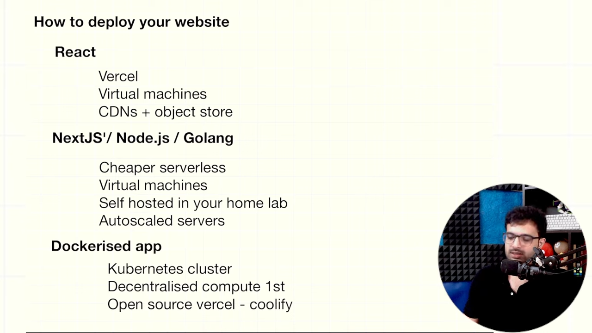
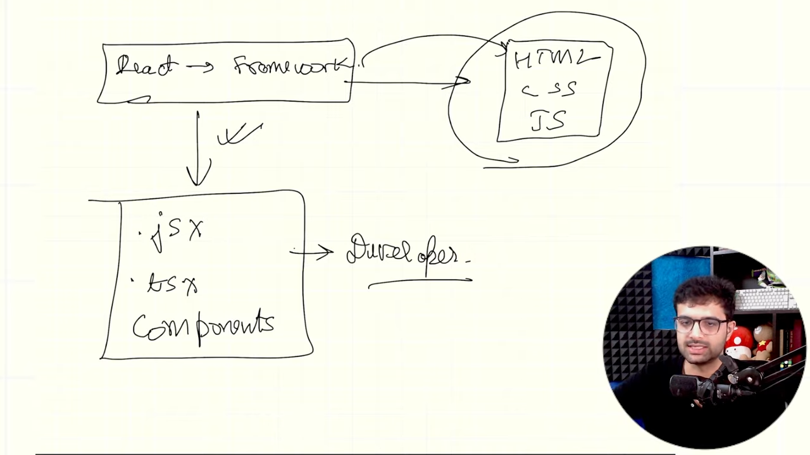
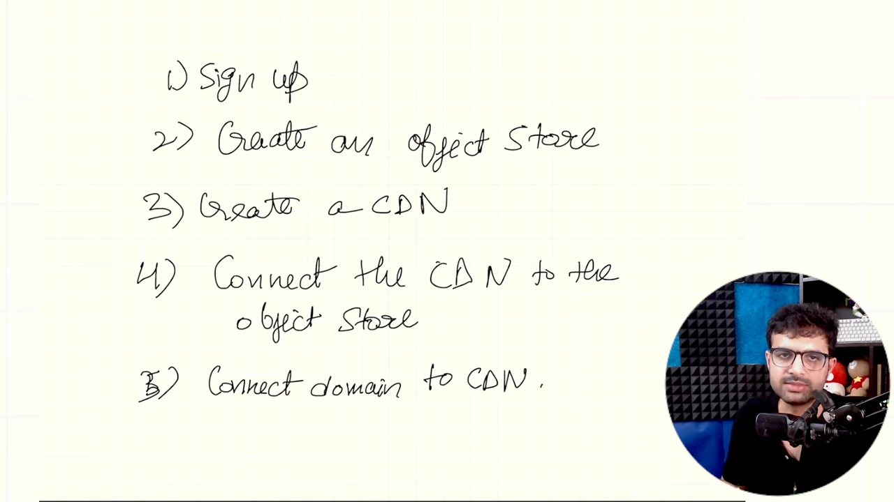

# Vm: 
- AWS, GCP, vulter, Digital Ocean etc
- VM: virtual machine, public ip
- Steps:
    - Get a Virtual machine
    - Install Nodejs onto the Machine
    - Import/ Copy over the Source Code onto the Machine : digital ocean blog, git clone <repo_name>
    - Start your Application, either on PORT 5173 in dev mode or PORT 80 in production mode
    - But dev is not good, since we wanna see production stuff
    - So do npm run build which created a dist folder, it will have the final compressed html, css and js files
    - Then do npm install -g serve
    - run: serve, You can connect custom PORT, via Edit rules
    - And check in your IP for that IP
    - For running on default link, do: server -p 80 as generally the default port is 80 [ Need to install serve as a super user]

# Object Stores and CDN's
- Object Stores: stores object of files
- If serve files; then use CDN + Objs St
- CDN : A network of machines used to delivery content using POP `Point of Presence`
- If a req is made to the source, the pop get's the content and cache's it so that it can be delivered easily to anyone else needing it
- Object Store is more oriented towards Storing Large Objects
- CDN: AWS-> cloudfront, Cloudflare offering
- Object Store: S3, R2
- When to use this Combination ? 
    - Serving Videos: YT
    - Storing Jpegs: Insta
    - Static Website
- Good new cheap is Bunny
