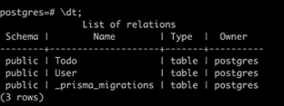

Local Run gives: 

# Prisma client

- auto generated client means: schema.prisma -> nodejs (where we can run user queries)
- Here prisma will auto generate clients so that your user can understand them
- There are javascript classes or javascript clients that index.ts can use
