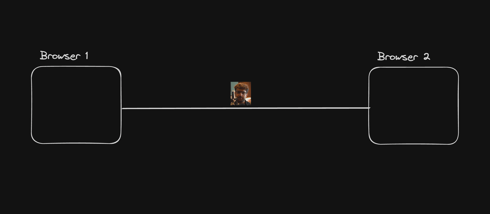
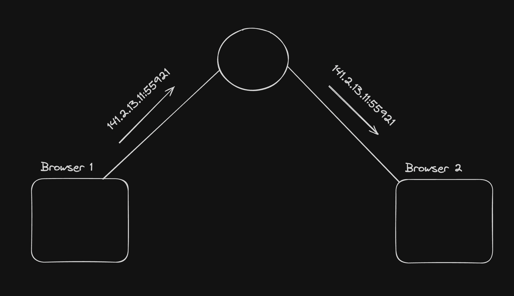
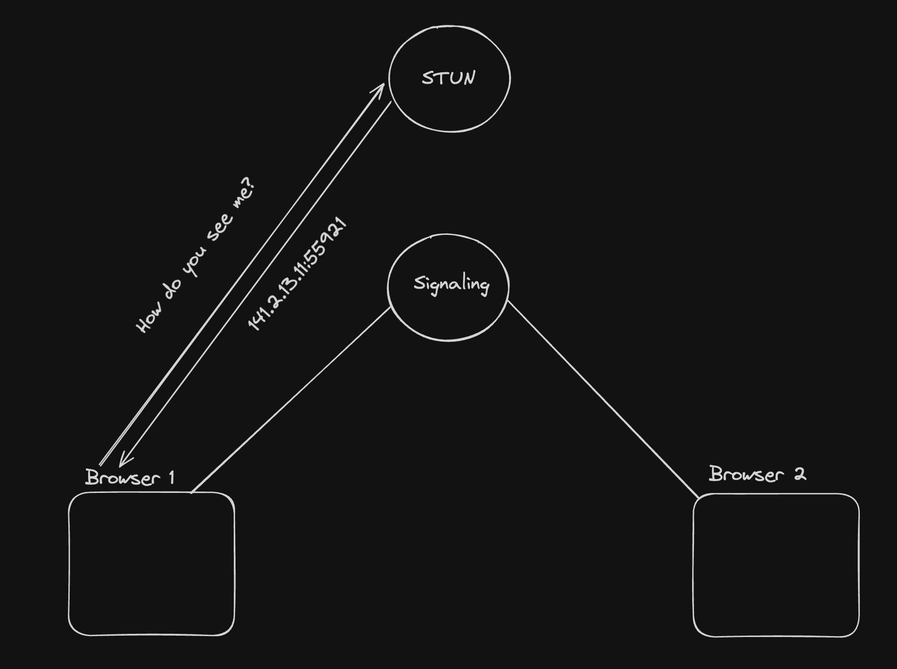

# WebRTC
- WebRTC is the core/only protocol that lets you do real time media communication from inside a browser.
- You use WebRTC for applications that require sub second latency. Examples include
    - Zoom/Google meet (Multi party call)
    - Omegle, teaching (1:1 call)
    - 30FPS games (WebRTC can also send data)

# P2P
- WebRTC is a peer to peer protocol. This means the you directly send your media over to the other person without the need of a central server

# Signalling Server
- Both the browsers need to exchange their address before they can start talking to each other. A signaling server is used for that. 
It is usually a websocket server but can be anything (http)

# Stun (Session Traversal Utilities for NAT)
- It gives you back your publically accessable IPs. It shows you how the world sees you

# Ice candidates
- ICE (Interactive Connectivity Establishment) candidates are potential networking endpoints that WebRTC uses to establish a connection between peers. Each candidate represents a possible method for two devices (peers) to communicate, usually in the context of real-time applications like video calls, voice calls, or peer-to-peer data sharing.
- If two friends are trying to connect to each other in a hostel wifi , then they can connect via their private router ice candidates. 
- If two people from different countries are trying to connect to each other, then they would connect via their public IPs.

# Offer
- The process of the first browser (the one initiating connection) sending their ice candidates to the other side.

# Answer
- The other side returning their ice candidates is called the answer.